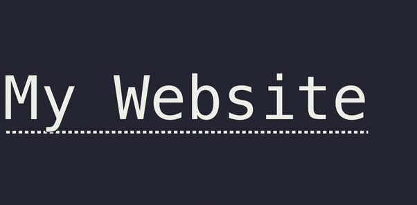

# terminal-link [](https://travis-ci.org/sindresorhus/terminal-link)

> Create clickable links in the terminal




## Install

```
$ npm install terminal-link
```


## Usage

```js
const terminalLink = require('terminal-link');

const link = terminalLink('My Website', 'https://sindresorhus.com');
console.log(link);
```


## API

### terminalLink(text, url, [options])

[Supported terminals.](https://gist.github.com/egmontkob/eb114294efbcd5adb1944c9f3cb5feda)

For unsupported terminals, the link will be printed in parens after the text: `My website (https://sindresorhus.com)`.

#### text

Type: `string`

Text to linkify.

#### url

Type: `string`

URL to link to.

#### options

Type: `Object`

##### fallback

Type: `Function`

Override the default fallback. The function receives the `text` and `url` as parameters and is expected to return a string.

### terminalLink.isSupported

Type: `boolean`

Check whether the terminal support links.

Prefer just using the default fallback or the `fallback` option whenever possible.


## Related

- [terminal-link-cli](https://github.com/sindresorhus/terminal-link-cli) - CLI for this module
- [ink-link](https://github.com/sindresorhus/ink-link) - Link component for Ink
- [chalk](https://github.com/chalk/chalk) - Terminal string styling done right


## License

MIT © [Sindre Sorhus](https://sindresorhus.com)
